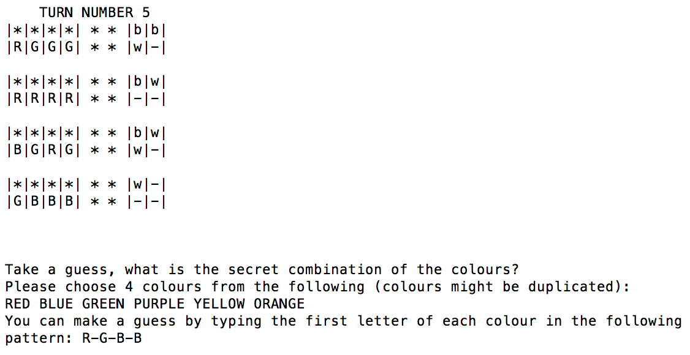

#  Mastermind game in Object Oriented Ruby

MasterMind is a code-breaking game for two players. You can choose to be a codebreaker or a codemaker. You have an option to play with another user or with computer.



## Getting Started

To play the game, please fire up the following command in bash (assuming you have ruby installed there ([Check how to instal](https://gorails.com/setup/osx/10.12-sierra)) )
```
$ ruby mastermind.rb

```

## Authors

* **Dariusz Biskupski** - *Initial work* - https://dariuszbiskupski.com


## Acknowledgments

It is part of the assignment created for [Viking Code School](https://www.vikingcodeschool.com/)
